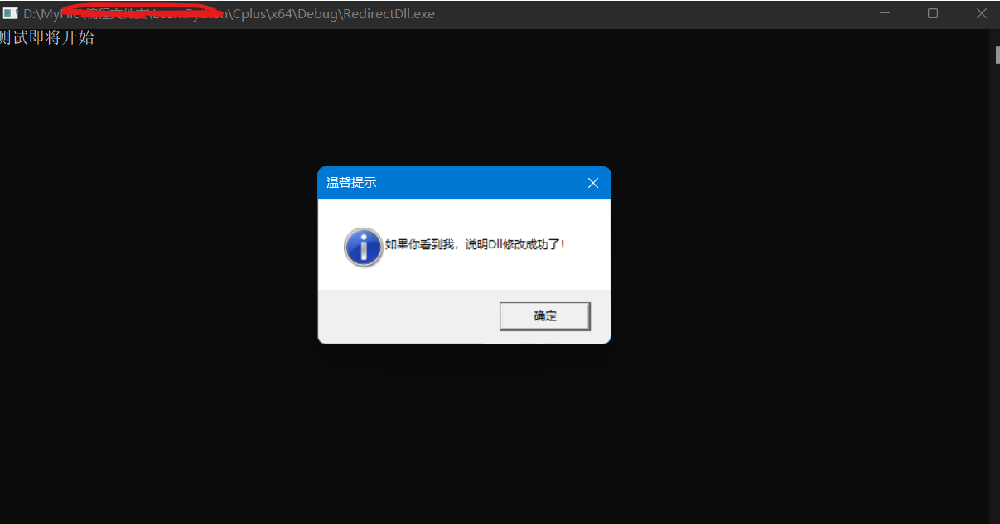

# MemoryDll-DllRedirect
   - 这是一种很奇怪的实现Dll重定向到内存的方法。
   - 利用Hook实现。
   - 只能在Windows上使用。
   - Hook了NtOpenFile和NtMapViewOfSection。

# 源码解析：
   - MyHook.cpp里面仅仅是一个简单的APIHOOK，
      - 兼容x64和x86
	  - 利用修改函数头实现
	  - \*兼容性未知。（可自行替换为自己的APIHOOK）

   - Main.cpp：
      - 首先Hook了NtOpenFile函数。
	  - 然后利用LoadLibraryW加载“advapi32res.dll”（Dll无所谓，只要是一个Dll就行，这个Dll只是一个傀儡Dll，后面不会加载它的）
	  - Hook的回调函数大致如下：
	  
```
#if _WIN64
NTSTATUS MyNtOpenFile(PHANDLE FileHandle,
	ACCESS_MASK DesiredAccess,
	POBJECT_ATTRIBUTES ObjectAttributes,
	PIO_STATUS_BLOCK IoStatusBlock,
	ULONG ShareAccess,
	ULONG OpenOptions) 
\#elif _WIN32
NTSTATUS __stdcall MyNtOpenFile(PHANDLE FileHandle,
	ACCESS_MASK DesiredAccess,
	POBJECT_ATTRIBUTES ObjectAttributes,
	PIO_STATUS_BLOCK IoStatusBlock,
	ULONG ShareAccess,
	ULONG OpenOptions)
#endif
{

	g_MyNtOpenFileHook.Suspended();
	//先暂停Hook
	NTSTATUS result;
	result = ((MyNtOpenFileCall)g_MyNtOpenFileHook.GetOldFunction())(FileHandle,
		DesiredAccess,
		ObjectAttributes,
		IoStatusBlock,
		ShareAccess,
		OpenOptions);
	//调用原函数
	if (wcsstr(ObjectAttributes->ObjectName->Buffer, L"advapi32res.dll")) {
		//如果是加载的sxs.dll
		g_MyNtOpenFileHook.Stop();
		//取消Hook
		g_MyNtMapViewOfSectionHook.Start("ntdll.dll", "NtMapViewOfSection", (FARPROC)MyNtMapViewOfSection);
		return result;
	}
	g_MyNtOpenFileHook.Restore();
	//恢复Hook
	return result;
}
```
   - 可以看到，其实加载Dll时先调用NtOpenFile打开Dll文件（内部接着会调用NtCreateSection和NtMapViewOfSection对文件句柄进行映射）
   - 接着便是Hook了NtMapViewOfSection函数，然后使用自己的“MyMapDll”函数将另外一个Dll映射到内存
   - 映射代码大致如下：
```
void MyMapDll(byte* DllData,
    PVOID* BaseAddress,
    PSIZE_T ViewSize
) {
	//获取基地址
    __int64 DllMemoryBase = (__int64)&DllData[0];
    PIMAGE_DOS_HEADER DOSHeader = (PIMAGE_DOS_HEADER)DllMemoryBase;
	//读出文件DOS头
    if (DOSHeader->e_magic == IMAGE_DOS_SIGNATURE) {
		//检测MZ头
        PIMAGE_NT_HEADERS NTHeader = (PIMAGE_NT_HEADERS)(DllMemoryBase + DOSHeader->e_lfanew);
        if (NTHeader->Signature == IMAGE_NT_SIGNATURE) {
			//检测PE头
            PVOID l_location, l_lpBaseAddress;
            PIMAGE_SECTION_HEADER Sectionheaders;
            __int64 SectionOffset;
            SectionOffset = DOSHeader->e_lfanew + sizeof(IMAGE_NT_HEADERS);//IMAGE_SECTION_HEADER在内存中的偏移
            *BaseAddress = VirtualAlloc(NULL, 
				NTHeader->OptionalHeader.SizeOfImage, 
				MEM_COMMIT, 
				PAGE_EXECUTE_READWRITE);
			//分配一块内存供给Dll使用
            *ViewSize = NTHeader->OptionalHeader.SizeOfImage;
			//下面开始根据SECTION信息将Dll数据逐步映射到内存
            int l_count = NTHeader->FileHeader.NumberOfSections;
			//拷贝DOS头
            RtlMoveMemory(*BaseAddress, &DllData[0], SectionOffset + sizeof(IMAGE_SECTION_HEADER) * l_count);
			//设置头部的保护
			VirtualProtect(&DllData[0], 0x1000, PAGE_READONLY, 0);
            for (int i = 0; i < l_count; i++) {
                Sectionheaders = (PIMAGE_SECTION_HEADER)(DllMemoryBase + SectionOffset);
                if (Sectionheaders->PointerToRawData != 0) {
					//如果Sectionheaders->PointerToRawData不为0，表示该段是有数据的，需要拷贝。
					l_location = (PVOID)(DllMemoryBase + Sectionheaders->PointerToRawData);
					l_lpBaseAddress = (PVOID)((__int64)*BaseAddress + Sectionheaders->VirtualAddress);
					//将段数据拷贝到分配的内存中
                    RtlMoveMemory(l_lpBaseAddress, l_location, Sectionheaders->SizeOfRawData);
					//设置保护
                    VirtualProtect(l_lpBaseAddress, 
						Sectionheaders->Misc.VirtualSize, 
						GetProtect(Sectionheaders->Characteristics), 
						0);
                }
                SectionOffset += sizeof(IMAGE_SECTION_HEADER);
				//读取下一个SECTION
            }
        }
    }
}
```
   - 其实说白了就是将Dll的SECTION全部加载到内存就可以了
   - 拷贝完真实的Dll之后，只需将“映射”到的地址和大小数据给回“NtMapViewOfSection”即可。
   - 什么IAT修复、TLS、异常之类东西，就全部交回给系统原生的Dll加载程序处理就好了。

# 一些闲话：
   - 为什么使用这样的方法加载Dll呢？
   - 因为这样可以提高内存Dll的稳定性（比较我们只处理了加载数据部分，其他部分全是系统处理的）
   - 本方法实现的MemoryDll可以基本兼容系统的相关Library命令（比如GetProcAddress）
   - 同时因为没有调用NtMapViewOfSection，可以绕过监听到Dll加载的方法（注意Dll文件的PE头、PEB中的双链并没有抹掉）
   - 不过话说回来，C++中这样搞的意义确实不是很大，可能对我来说主要的价值是学习价值吧。
   - 提示：如果你在其他论坛看到类似代码，那也可能我发的。

## 实现结果：
   - 记得将用于测试的“CDll_x64.dll”和“CDll_x86.dll”编译出来哦！
   - x64测试：
   - x86测试：
